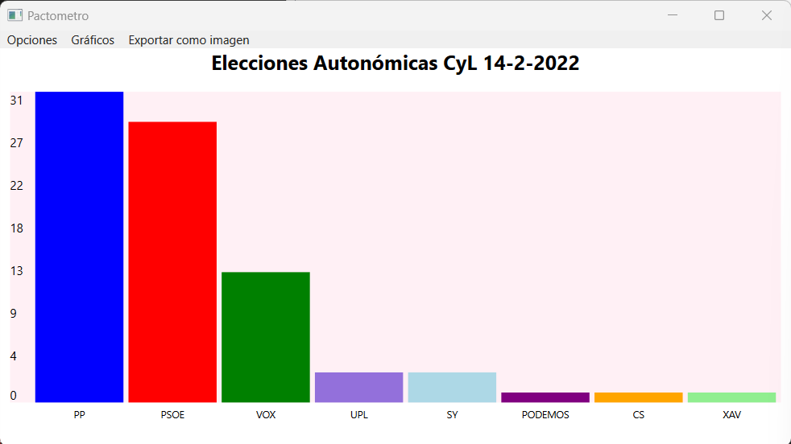
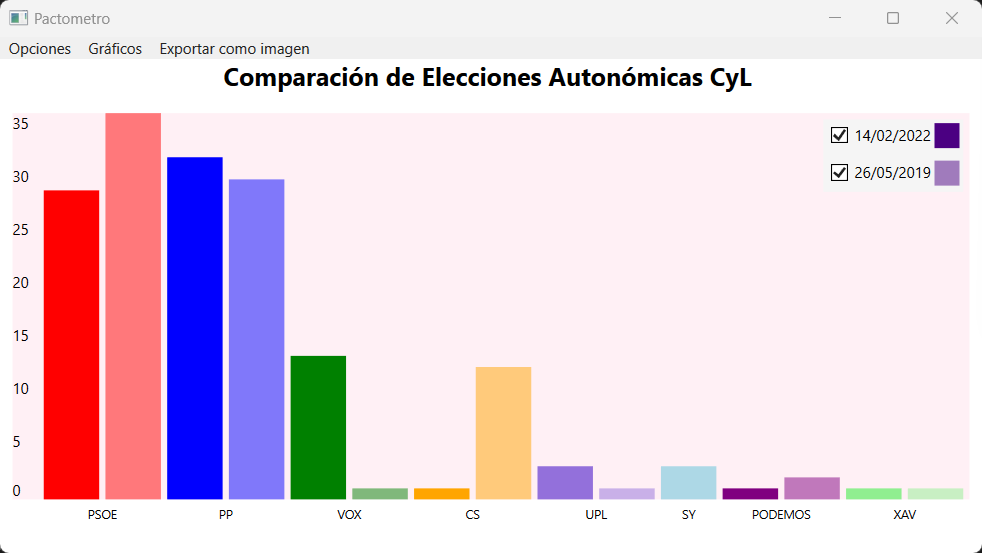
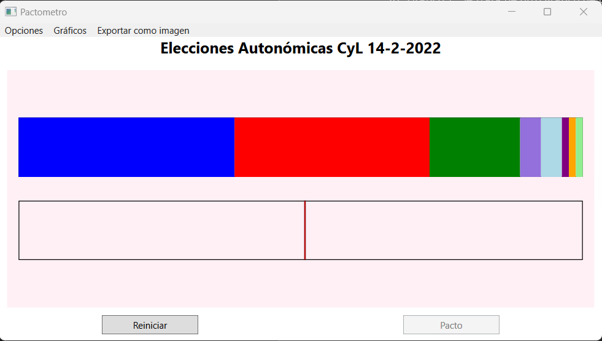
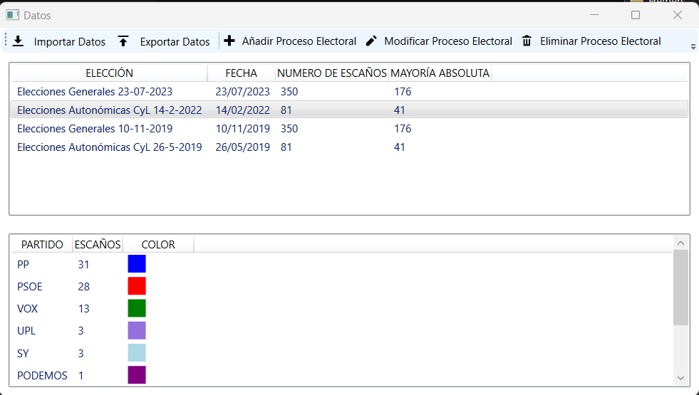
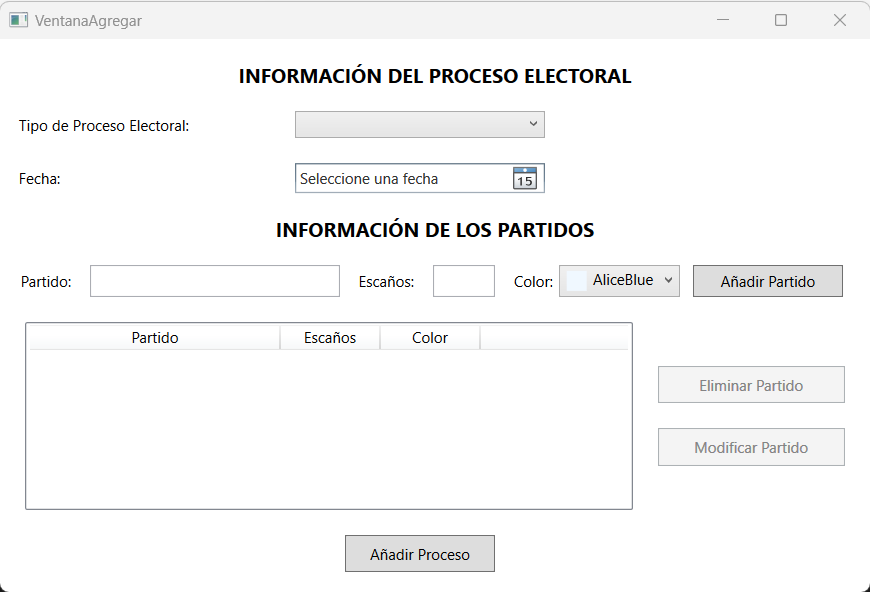
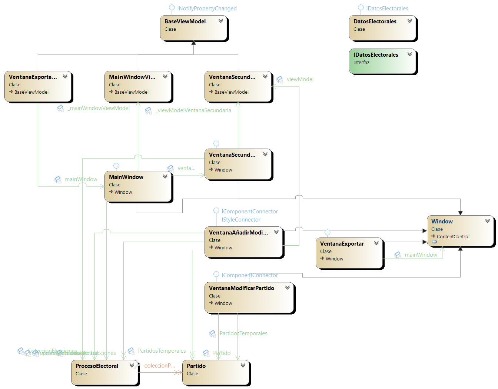

# Pactometro

Desktop application that visualizes Spanish electoral results and lets you simulate political coalitions interactively. Built as a university project for the **Interfaces Graficas de Usuario (IGU)** course, focused on the MVVM architectural pattern and custom WPF rendering.

The app loads real data from Spanish General Elections and Castilla y Leon regional elections, renders fully custom charts (no charting libraries), and features an interactive **pactometer** where you drag parties between coalition bars to test if they reach absolute majority.

<div align="center">
  
</div>

## Features

- **Election bar charts** — Visualize seat distribution for any loaded electoral process, with each party drawn in its official color
- **Comparative charts** — Side-by-side comparison of the same parliament across different election years, with a legend toggle for each date
- **Interactive pactometer** — The core feature: a horizontal stacked bar showing all parties. Click a party to move it into the coalition bar below. When the coalition reaches absolute majority (marked by a red threshold line), the "Pacto" button activates
- **Data management** — A secondary window to browse, add, modify, and delete electoral processes and their parties (name, seats, color)
- **Import/Export** — Load and save electoral datasets as CSV or JSON
- **Image export** — Save any chart as PNG or JPG (with quality settings), or copy directly to clipboard

## Screenshots

<div align="center">

**Comparative chart — CyL regional elections across years**



**Pactometer — Interactive coalition builder**



**Data window — Electoral processes and party details**



**Add electoral process — Party management dialog**



</div>

## How it works

1. The app opens two windows: the **main chart window** and a **data management window**
2. Select an electoral process from the data window to see its parties and seat counts
3. Choose a chart type from the **Graficos** menu:
   - **Grafico 1** — Bar chart for the selected election
   - **Grafico 2** — Comparative bars across elections of the same type
   - **Grafico 3** — The pactometer view
4. In pactometer mode, click parties in the top bar to move them into the coalition bar below
5. When the coalition reaches **absolute majority**, click "Pacto" to confirm it
6. Export any chart via **Exportar como imagen** (PNG/JPG/clipboard)

## Pre-loaded data

The app ships with real results from:
- **Elecciones Generales** — 23/07/2023, 10/11/2019 (350 seats, 176 majority)
- **Elecciones Autonomicas CyL** — 14/02/2022, 26/05/2019 (81 seats, 41 majority)

Parties include PP, PSOE, VOX, Sumar, CS, UPL, Soria Ya, Podemos, and more — each with their official colors.

## Architecture

The project follows the **MVVM** (Model-View-ViewModel) pattern:

```
Pactometro/
├── Model/
│   ├── ProcesoElectoral.cs    # Election process (type, date, seats, parties)
│   ├── Partido.cs             # Political party (name, seats, color)
│   ├── DatosElectorales.cs    # Data loader with pre-loaded election results
│   └── IDatosElectorales.cs   # Data interface
├── ViewModels/
│   ├── BaseViewModel.cs                # Base with INotifyPropertyChanged
│   ├── MainWindowViewModel.cs          # Chart rendering logic, window management
│   ├── VentanaSecundariaViewModel.cs   # Data CRUD, import/export, sorting
│   └── VentanaExportarViewModel.cs     # Image export options
├── Views/
│   ├── MainWindow.xaml                 # Main chart canvas and menus
│   ├── VentanaSecundaria.xaml          # Data browser with dual ListViews
│   ├── VentanaAnadirModificar.xaml     # Add/edit electoral processes
│   ├── VentanaModificarPartido.xaml    # Edit individual party details
│   └── VentanaExportar.xaml            # Export format and quality picker
├── Helpers/                            # Input validation utilities
└── src/                                # Icons and image assets
```

<div align="center">

**Object diagram**



</div>

**Key design decisions:**
- All three chart types are drawn on a WPF `Canvas` using **custom rendering** — no external charting libraries
- Non-modal secondary window for data management, synced with the main chart view via shared ViewModels
- Material Design theme via [MaterialDesignInXAML](https://github.com/MaterialDesignInXAML/MaterialDesignInXamlToolkit)

## Tech stack

| | |
|---|---|
| **Language** | C# |
| **Framework** | .NET Framework 4.7.2 |
| **UI** | WPF (Windows Presentation Foundation) |
| **Pattern** | MVVM |
| **Styling** | Material Design (MaterialDesignInXAML) |
| **Serialization** | Newtonsoft.Json |
| **Image export** | WriteableBitmapEx |

## Running it

1. Open `Pactometro.sln` in Visual Studio
2. Build and run (F5)

> Requires .NET Framework 4.7.2 and Windows.

## Context

Built for the **Interfaces Graficas de Usuario (IGU)** course at Universidad de Salamanca, 2023-24. The project covers the full scope of desktop GUI development: multi-window management, custom drawing, data binding with MVVM, file I/O, and image export.
